# Projektna naloga - Azure
## Lokalna namestitev Docker-ja
Ker smo do sedaj pri predmetu Spletno programiranje (projektna naloga 1) razvili samo backend del aplikacije, smo v glavno mapo z backendom dodali datoteko `Dockerfile`.

V tej datoteki smo določili:
- osnovno sliko (Node.js),
- delovni direktorij,
- kopiranje konfiguracijskih datotek (priporočljivo je prekopirat tudi `package-lock.json`, da bi zmanjšali možnost za napako pri inštalaciji odvisnosti),
- namestitev odvisnosti,
- kopiranje preostale izvorne kode,
- določitev vrat,
- zagon aplikacije
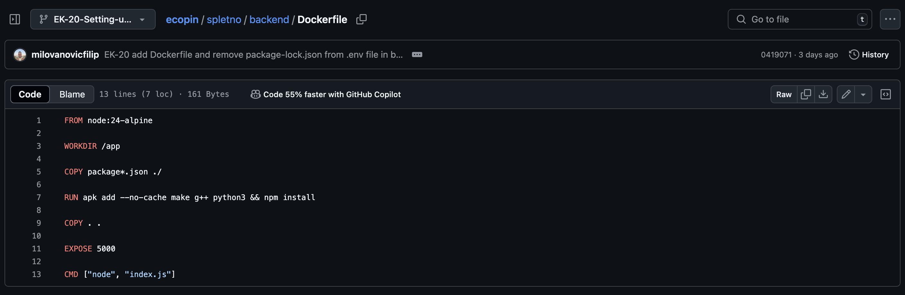

Ko bomo imeli izdelan tudi frontend, bomo pripravili še `docker-compose.yml` datoteko (v nadrejeni mapi obeh projektov), ki bo poenostavila skupni zagon vseh storitev.

Bazo imamo nameščeno na MongoDB Atlasu.

Projekt smo naložili na GitHub, da bomo lahko kasneje klonirali repozitorij na Azure VM.

## Dostop do storitve Azure
Najprej smo ustvarili račun v Azure portalu z uporabo študentskega mail-a ter izbrali naročnino "Azure for Students", ter izbrali paket z dostopom do 750ur/mesec virtualnih naprav.
## Vspostavitev virtualne naprave
V Azure portalu smo ustvarili novo virtualno napravo (VM) z izbrano sliko: Ubuntu Server 22.04 LTS.
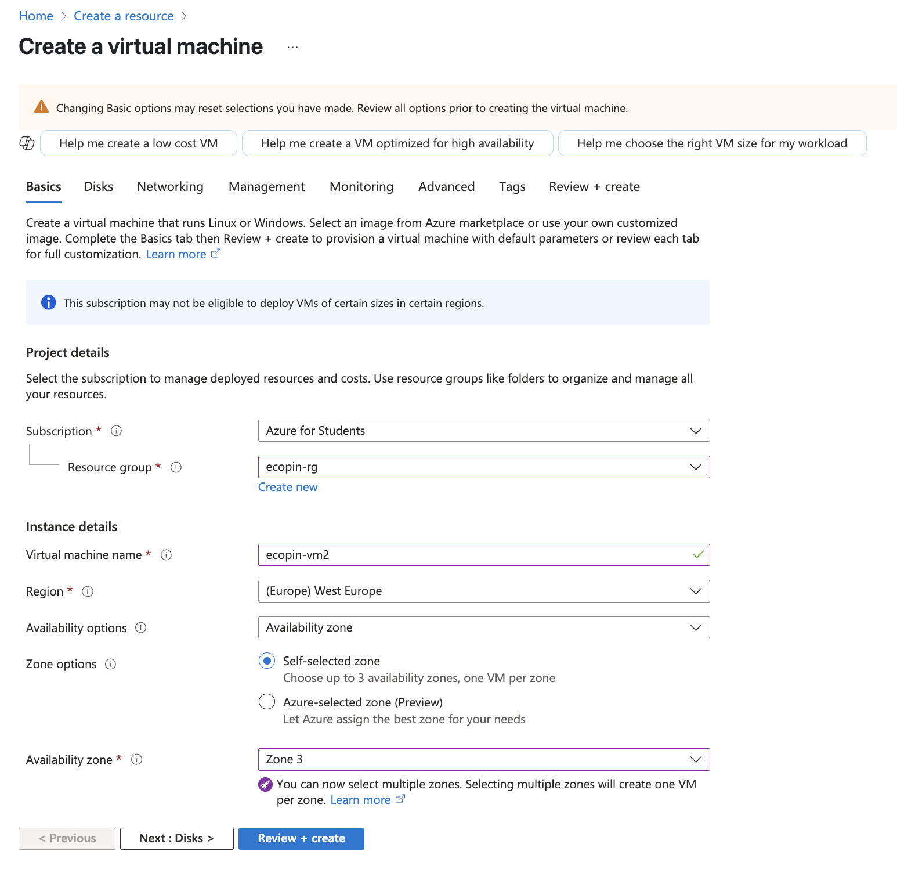
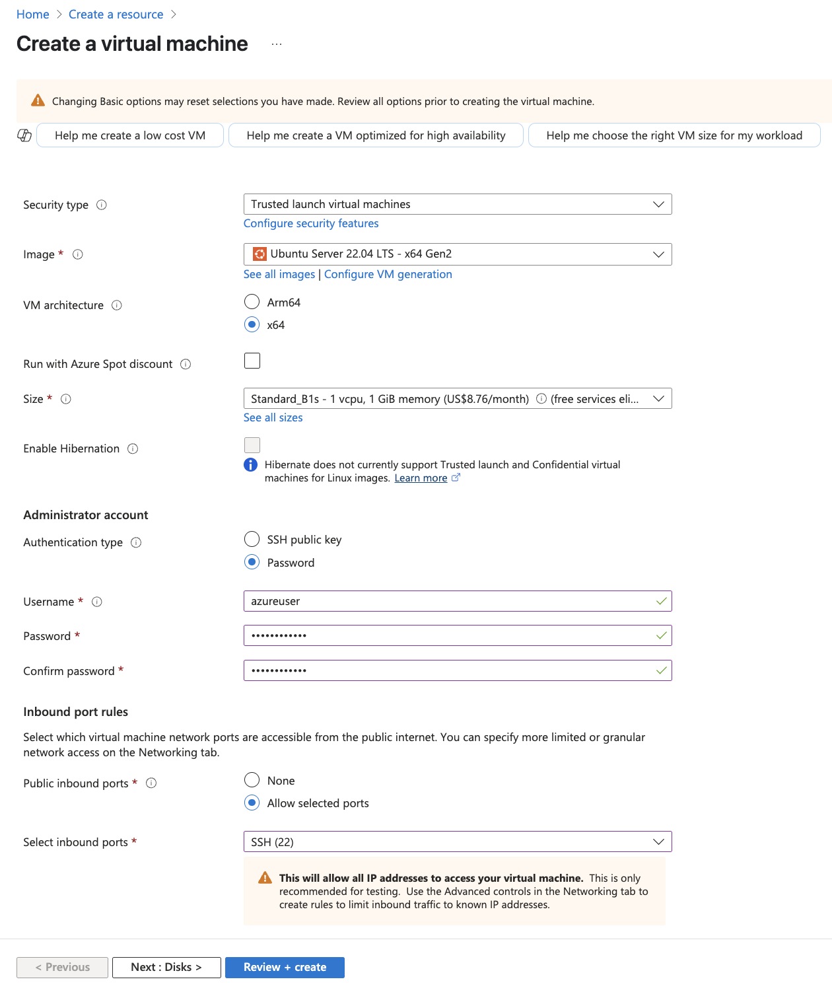

Po ustvarjanju smo si zapomnili public IP naslov, saj ga bomo uporabili za SSH dostop in za dostop do aplikacije (npr. `ssh uporabnik@IP`). Prvič smo se logirali z `ssh azureuser@20.73.3.104` in geslom, to je z uporabnikom, ki smo ga dodali pri ustvarjanju VM.
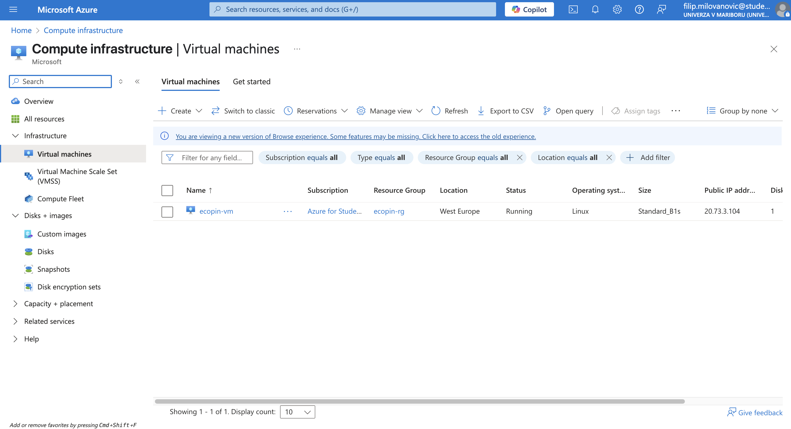
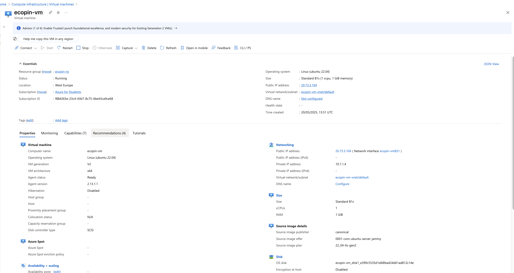

Na VM-ju smo ustvarili nove uporabnike z ukazom:
`sudo adduser filip`
(postopek smo ponovili za vsakega člana skupine).
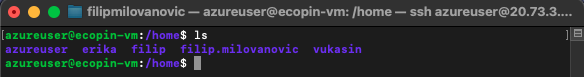
(`filip.milovanovic` je uporabnik dodan preko Azure portala, kasneje razloženo...)
### SSH dostop za vse uporabnike
Za vsak ustvarjenega uporabnika (`filip`, `erika`, `vukasin`) smo nastavili SSH dostop:
1) Na vsakem računalniku smo generirali SSH ključ:
`ssh-keygen`
2) Na VM-ju smo ustvarili `.ssh/authorized_keys` za vsakega uporabnika:
    ```
    sudo mkdir /home/filip/.ssh
    sudo nano /home/filip/.ssh/authorized_keys
    ```
3) Vanj smo prilepili javni ključ iz `~/.ssh/id_rsa.pub` (z lokalnih računalnikih).

S tem omogočimo prijavo brez gesla. Uporabnik `azureuser` ima `sudo` pravice, zato je vse nastavitve urejal on.
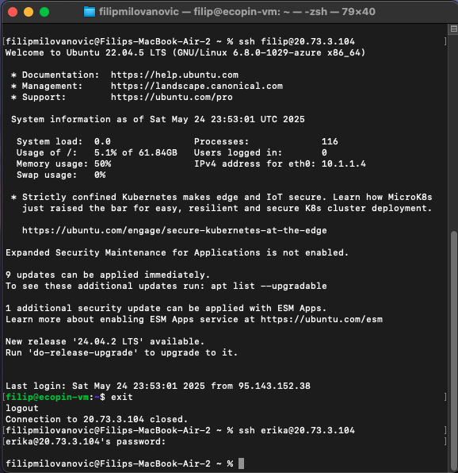

`Pozor: Ne smemo zamenjati datotek id_rsa (zasebni ključ) in id_rsa.pub (javni ključ)!`

Dodali smo še SSH dostop za `azureuser` preko enega izmed Azure account-ov (npr. od vodje skupine) na portalu (Azure CLI):
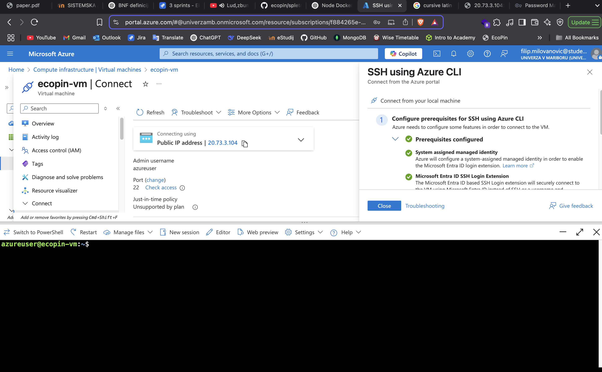

## Odgovori na Azure vprašanje
### 1) Kje in kako omogočite "port forwarding"?
Port forwarding omogočimo v nastavitvah VM-ja, in sicer:
1) Gremo na zavihek `Networking → Network settings`,
2) Kliknemo `Create port rule`, pa `Inbound port rule`,
3) Nastavimo:
    - Destionation port ranges: 5000
    - Protocol: TCP
    - Action: Allow
    - Name: Allow-Port-5000

    to je:
    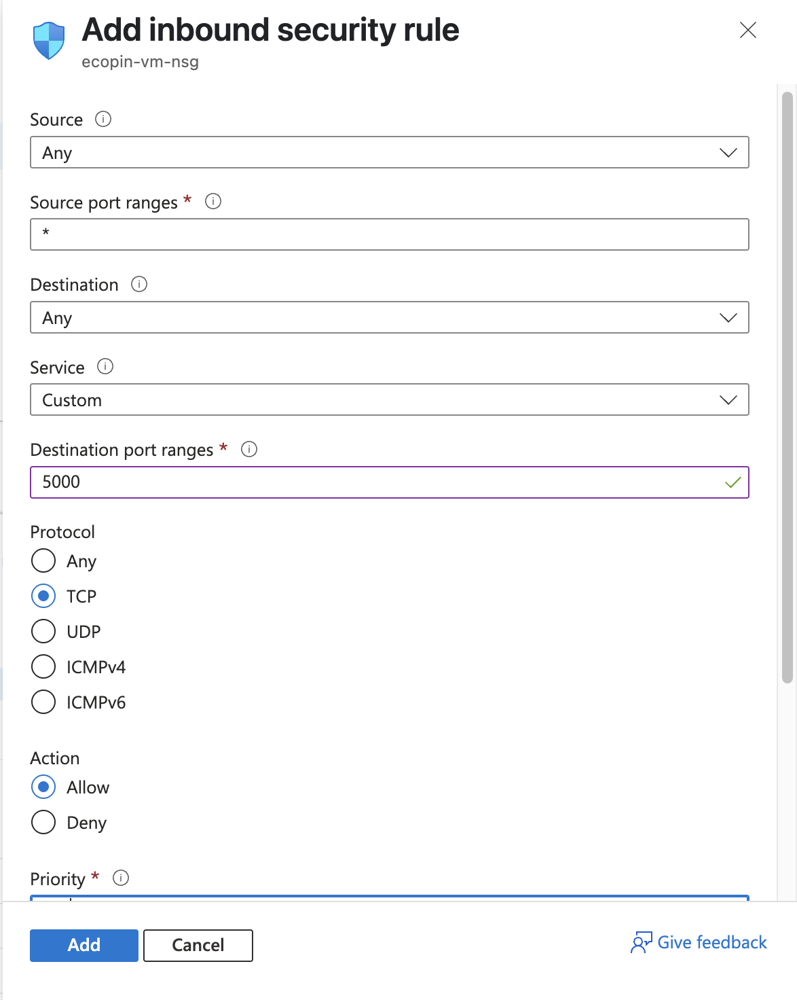
    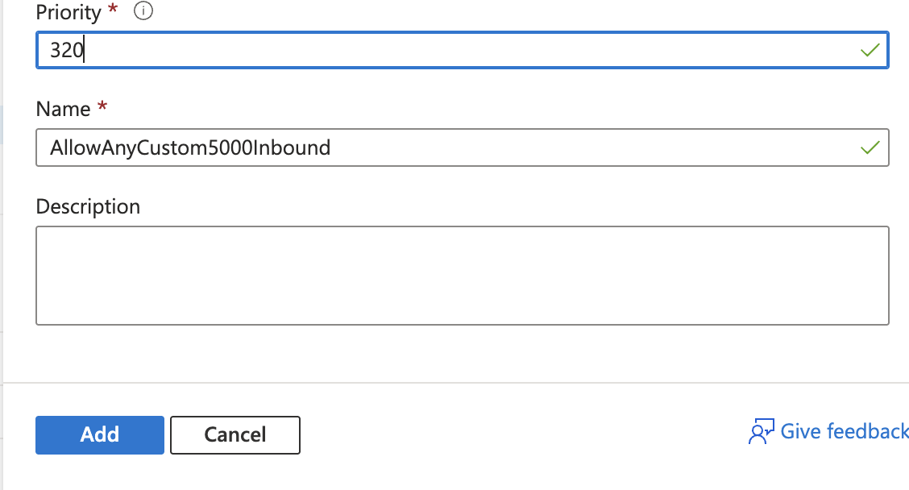

### 2) Kakšen tip diska je bil dodan vaši navidežni napravi in kakšna je njegova kapaciteta?
V iskalnik vpišemo `Disks`, nato se nam prikaže plošča z informacijami:
- Disk type: `Premium SSD LRS`
- Capacity: `64 GiB`
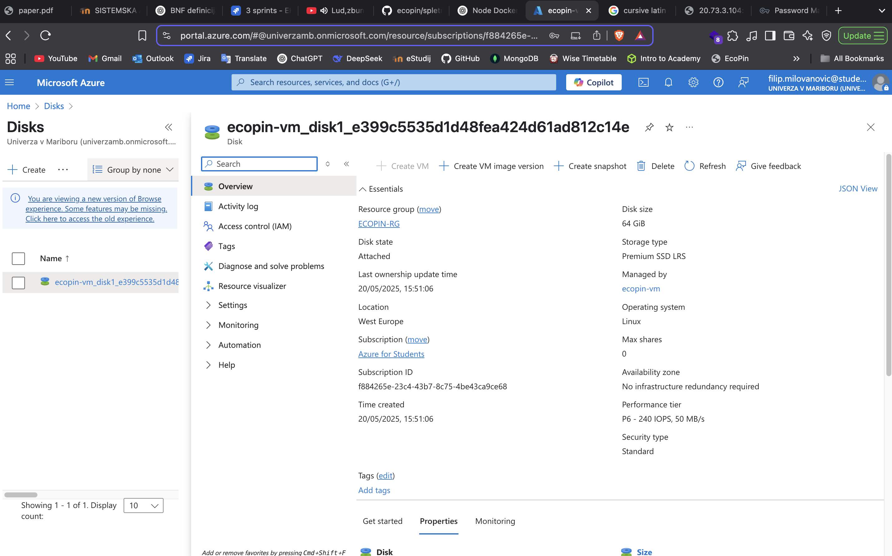

### 3) Kje preverimo stanje trenutne porabe virov v naši naročnini ("Azure for students")?
Stanje virov preverimo v zavihku: `Subscriptions → Azure for Students → Usage + quotas`
Tam lahko spremljamo porabo vCPU, pomnilnika in drugih omejenih virov:
- Standard BS Family vCPUs: 1 of 4 (25 %)
- Total Regional vCPUs: 1 of 6 (17 %)

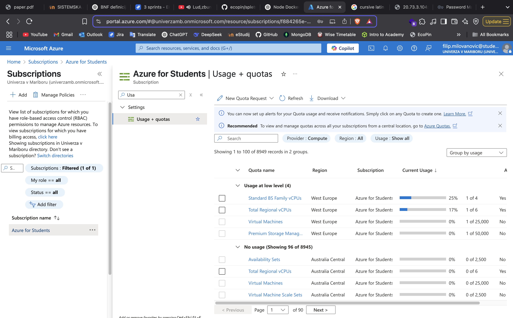
## Vzpostavitev Docker-ja na Azure
Za zagon naše aplikacije znotraj Azure VM-ja smo potrebovali:

1) Namestitev Gita in SSH dostopa do GitHub-a (opcija username-password ni več podpreta)
    ```
    sudo apt update
    sudo apt install git
    ssh-keygen -t ed25519 -C "milovanovic8filip@gmail.com"
    ```

    - Nato smo vsebino id_rsa.pub dodali v `GitHub → Settings → SSH and GPG keys → New SSH Key`
    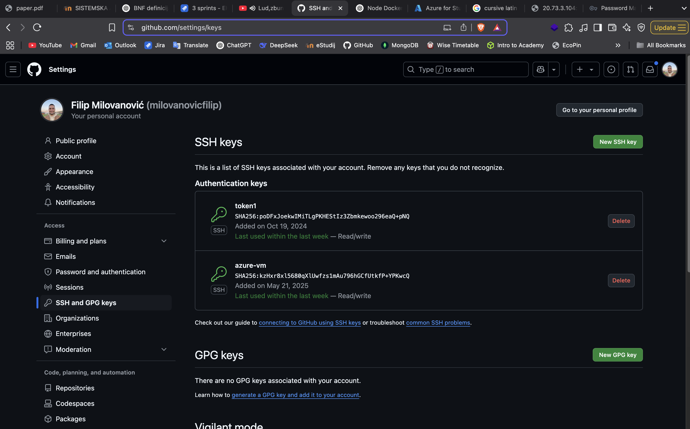
    - Projekt smo klonirali: `git clone git@github.com:milovanovicfilip/ecopin.git` v npr. `/home/azureuser/projects`. V tem slučaju če uporabniki hočejo spreminjat vsebino projekta, morajo imeti sudo privilegije, v nasprotnem samo `azureuser` lahko spreminja vsebino projekta (lahko tudi `root` ampak tega ne uprobljamo!)).
    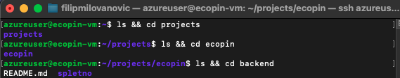

2) Namestitev Docker-ja:
    ```
    sudo apt install docker.io;
    sudo systemctl start docker;
    sudo systemctl enable docker;
    ```
3) Prilagoditev kode za zunanje povezave
V `index.js` datoteki (backend) smo poskrbeli, da aplikacija posluša na vse IP-je:

    ```
    app.listen(PORT,'0.0.0.0', () => {
    console.log(`Server running on port http://localhost:${PORT}`);
    console.log(`Auth0 Domain: ${process.env.AUTH0_DOMAIN}`);
    });
    ```
    Moramo dodat `0.0.0.0` kot drugi argument funkcije, default je `localhost`. 

4) Zagon aplikacije z Dockerjem

    V mapi z `Dockerfile`:
    ```
    cd ~/projects/ecopin/backend
    docker build -t myapp .
    docker run -d -p 5000:5000 myapp
    ```
    Tako aplikacijo zaženemo v ozadju in ta ostane aktivna, tudi če zapremo terminal.

5) Port forwarding na Azure
    Na portalu Azure smo dodali inbound port rule za port `5000` (opisano zgoraj).

## Testiranje aplikacije
Ko je vse nastavljeno, preverimo delovanje aplikacije:
- V brskalniku ali Postmanu obiščemo:
    ```
    http://20.73.3.104:5000/api/poi
    ```
    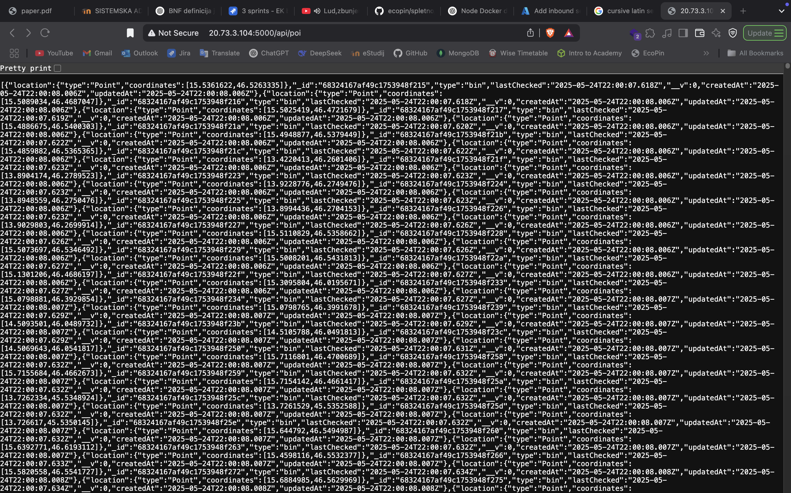

