# Projektna naloga - CI/CD
## Docker Hub container registry
### Ustvarjanje Docker Hub računa
Vodja mikro-skupine je ustvaril račun na https://hub.docker.com. Po uspešni registraciji smo ustvarili dva repozitorija:
* `ecopin-backend` (privatni)
* `ecopin-frontend` (javen)

Ob prvem `docker build` in `docker push` se repozitoriji samodejno ustvarijo, lahko pa tudi ročno – kot smo mi naredili.
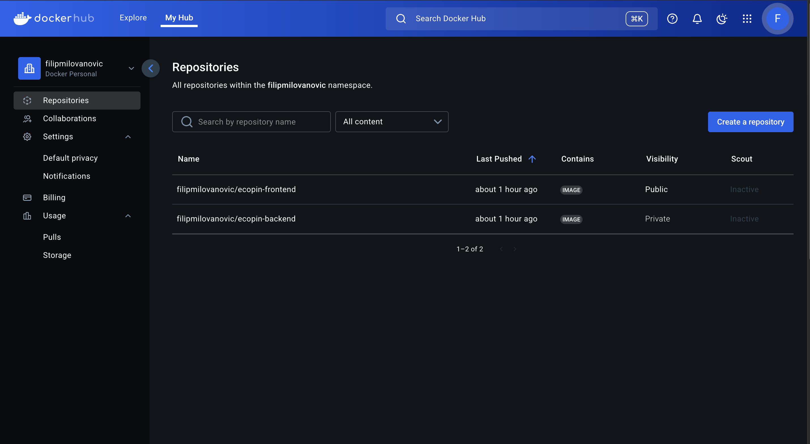
### Uporabljeni ukazi v CLI
```
docker login
docker build -t filipmilovanovic/[ecopin-backend ali ecopin-frontend]:[dev ali test ali latest] [./spletno/backend ali ./spletno/frontend]
docker push filipmilovanovic/[ecopin-backend ali ecopin-frontend]:[dev ali test ali latest]
docker pull filipmilovanovic/[ecopin-backend ali ecopin-frontend]:[dev ali test ali latest]
docker run -p [port]:[port] filipmilovanovic/[ecopin-backend ali ecopin-frontend]:[dev ali test ali latest]
```
Prijava v Docker Hub je bila izvedena z ukazom `docker login`, kjer smo kot geslo uporabili personal access token:
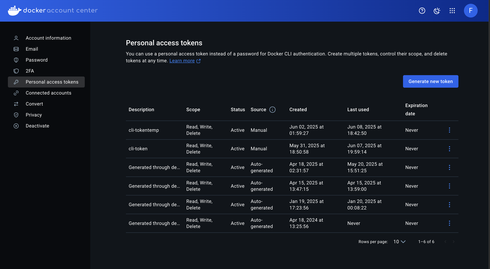
## GitHub Actions workflow
### Organizacija `.yml` datotek
V glavni mapi repozitorija smo ustvarili mapo `.github/workflows`, kamor smo dodali 3 `.yml` datoteke:

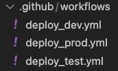

### Funkcionalnost workflow-ov
Vsak workflow:
- se prijavi na Docker Hub
- ustvari Docker sliko
- jo naloži na Docker Hub
- pošlje webhook sporočilo strežniku (če push uspe).

### Različna okolja in možne razširitve
* `:dev` (branch `dev`): razvojno okolje – možno dodati `ESLint/Prettier`
* `:test` (branch `release`): testno okolje – možno dodati unit teste (`Jest/Cypres`)
* `:latest` (branch `main`): produkcijsko okolje – uporablja se v `redeploy.sh`, trenutna aplikacija na http://20.73.3.104/

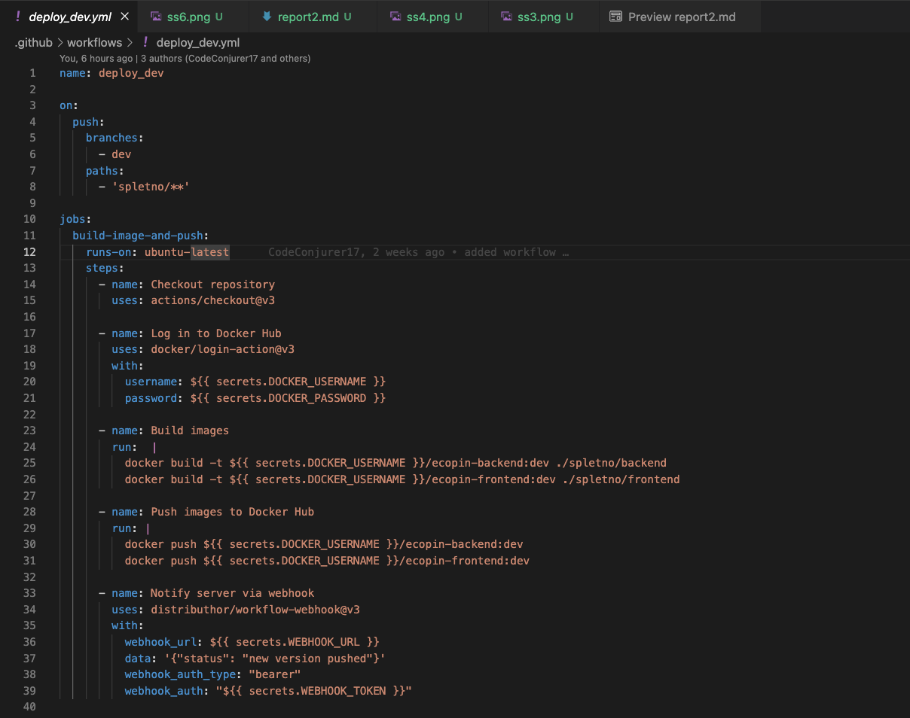
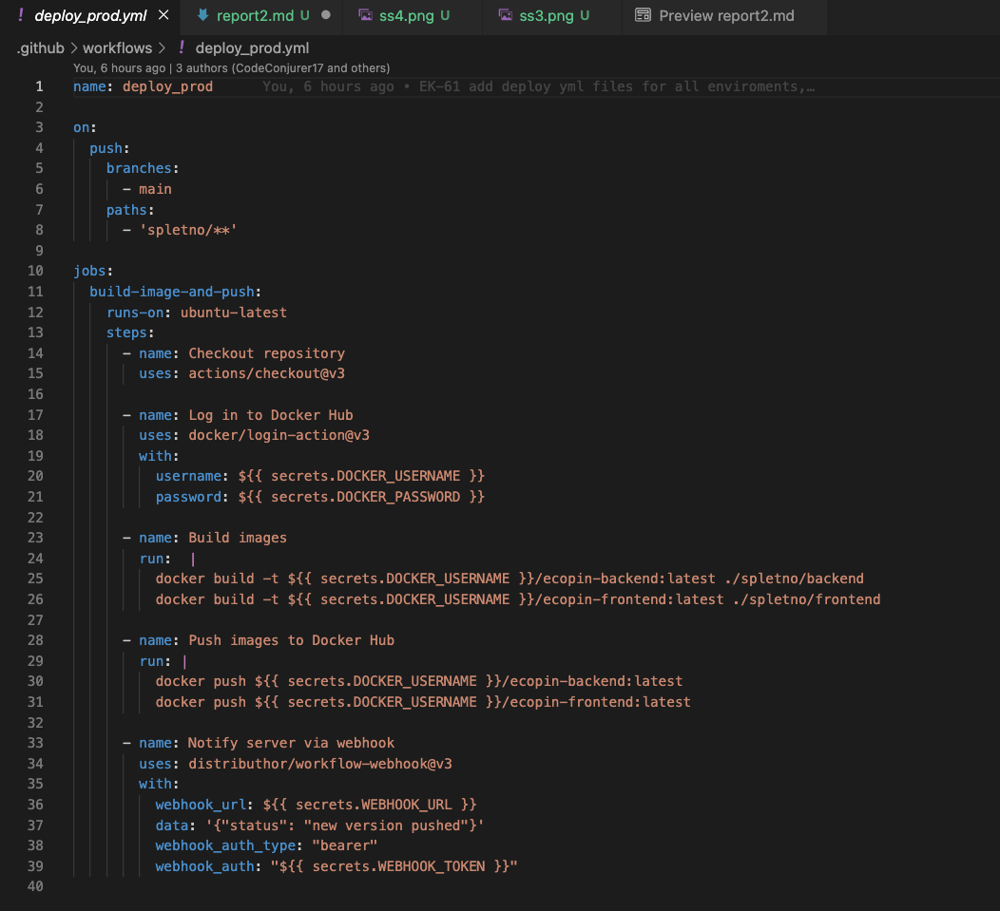
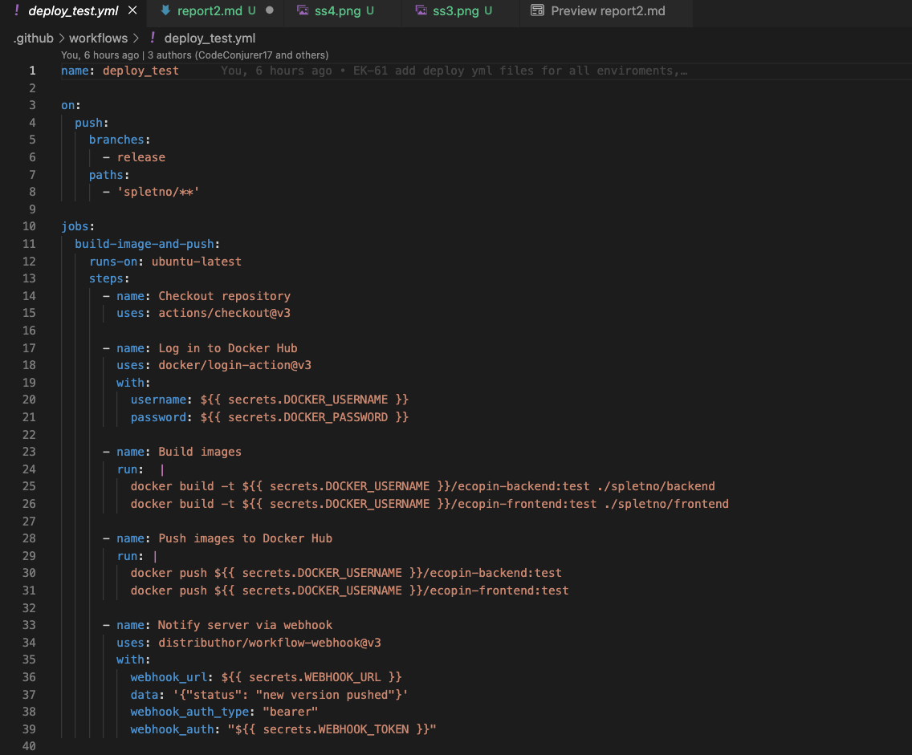

Docker slike se vedno gradijo iz ustrezne podmape v `./spletno`. Tako vidimo v posameznih container-ih so samo datoteke iz `backend` ali `frontend`.
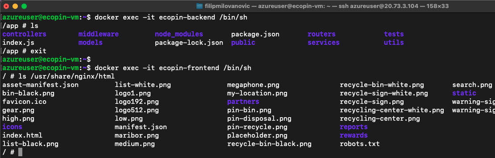

#### Prikaz delovanja workflow-a za `dev` okolje
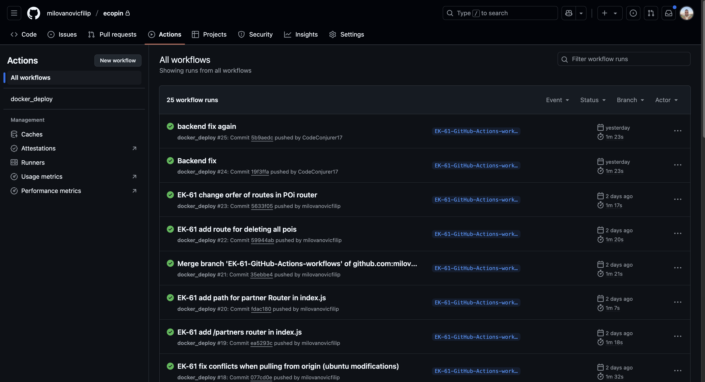
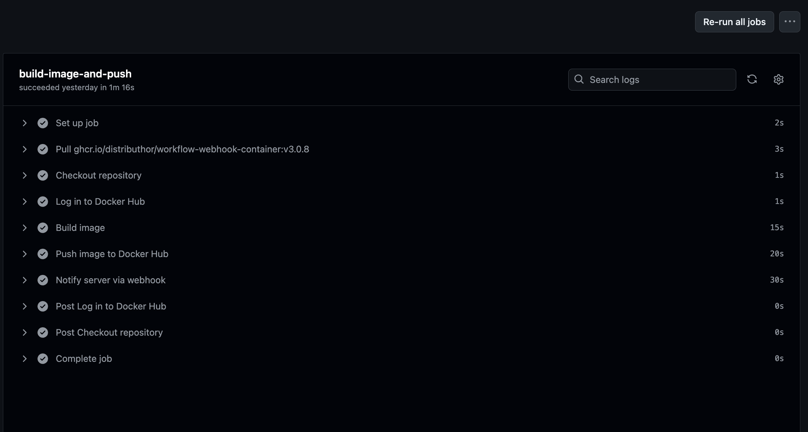
* Mogli smo uporabit trenutni branch za to vajo, ker v tistem trenutku nismo imeli česa pushat na `dev`.

### Uporaba GitHub Secrets
Vse privatne informacije (tokeni, URL-ji) so shranjene v `Settings > Secrets and variables > Actions`:
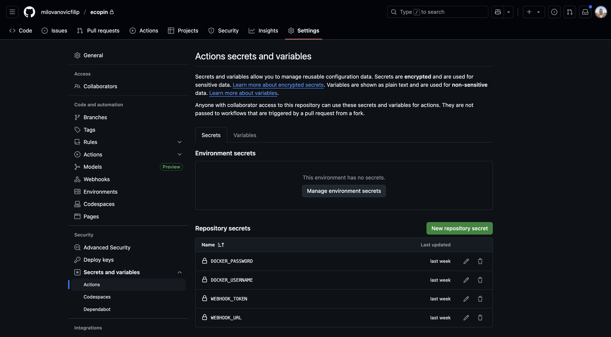

## Webhook
Uporabili smo Node.js strežnik z Express (`webhook.js`), ki sprejme `POST` zahtevo GitHub Action-a in zažene `redeploy.sh`, ki:
* ustavi obstoječ container
* pull-a najnovejši image
* zažene novi container iz novega image-a

Obe datoteki sta izven GitHub repozitorija.

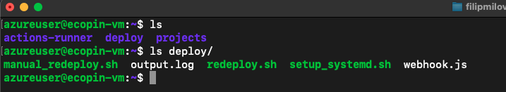

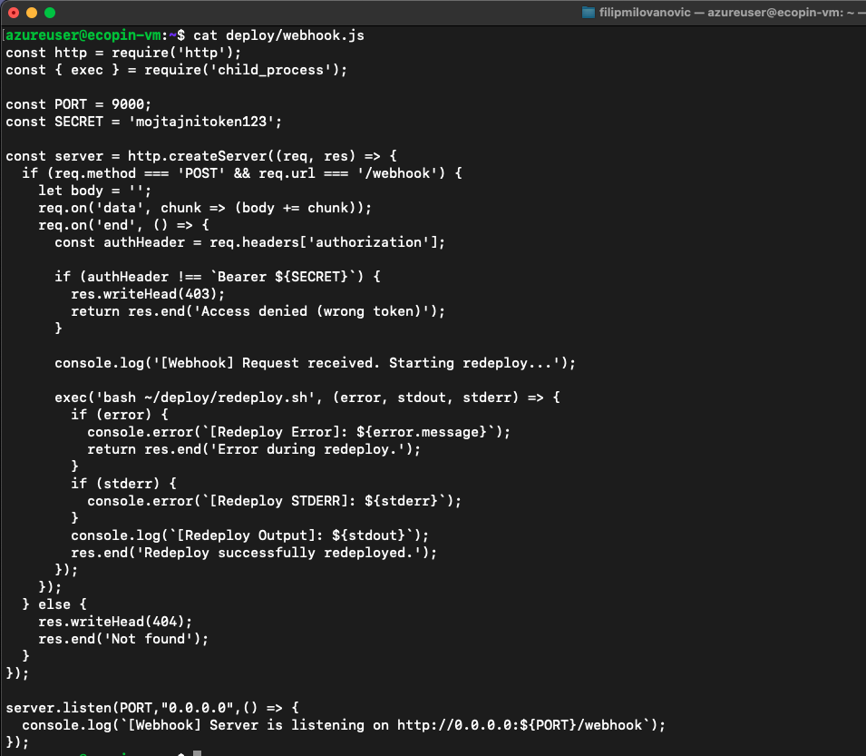

Webhook `secret` si sami definiramo (ni obvezen, ampak močno priporočljiv).

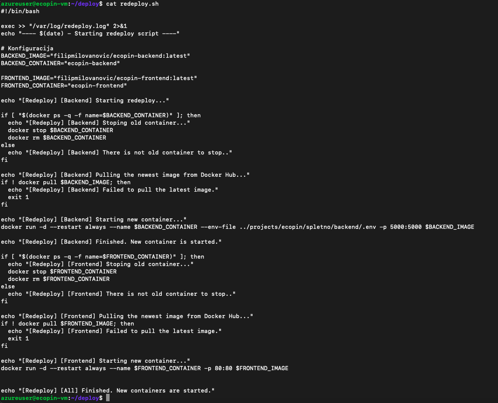
 
## Varnost v Webhook
### Izvede zaščite
* `webhook.js` se zažene z `pm2` (samodejno ob restartu strežnika)
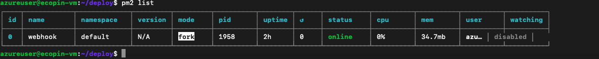
* preverjanje z `WEBHOOK_SECRET` tokenom
* logiranje vseh izhodov (prikazano v `redeploy.sh`)
* dovolimo `POST` zahteve samo:
    * iz GitHub subnetov (primer: `192.30.252.0/22`)
    * z `localhosta` (zaradi `~/deploy/manual_redeploy.sh`, ki v bistvu dela isto kot GitHub Actions (pol pa poklice Webhook za ostanek dela))
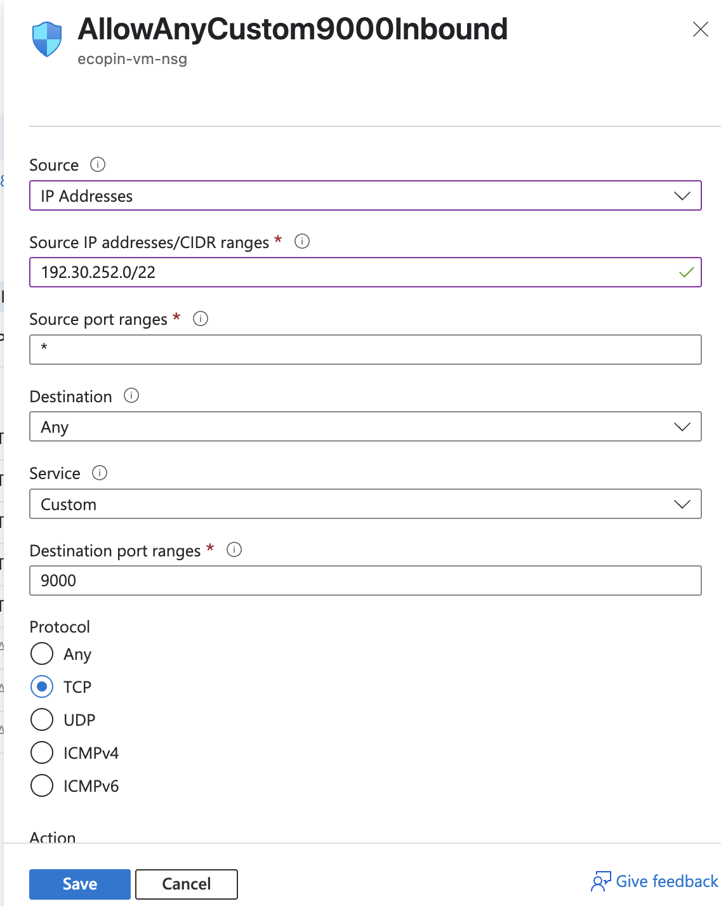
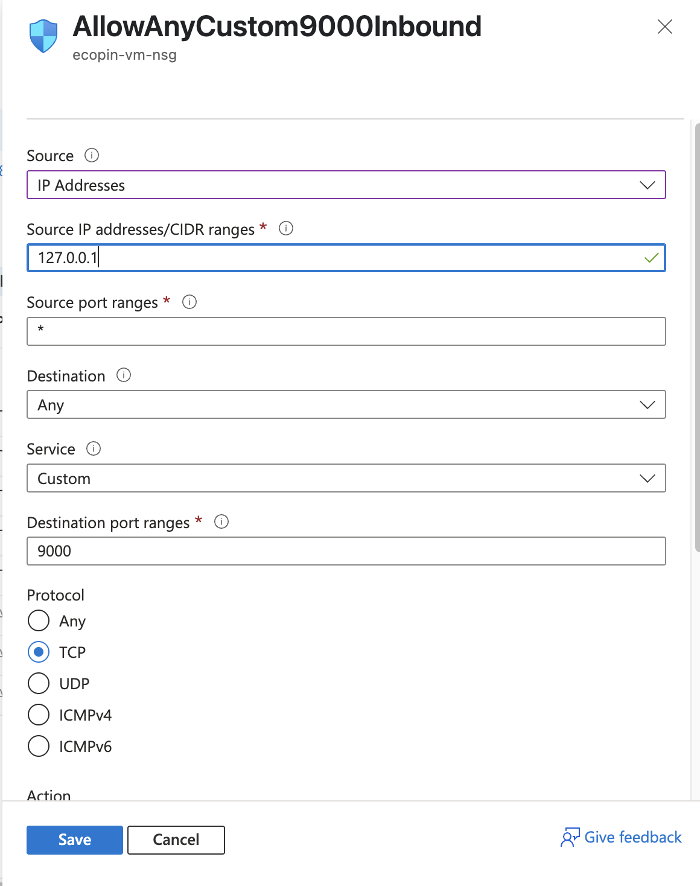
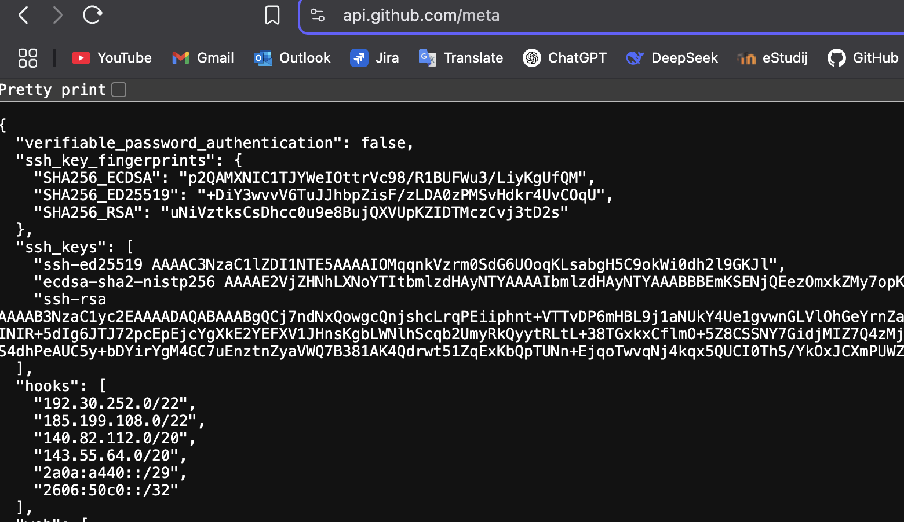
#### manual_redeploy.sh skripta:
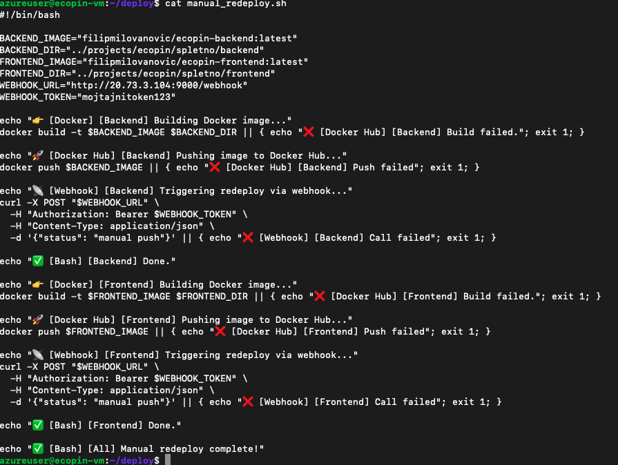


